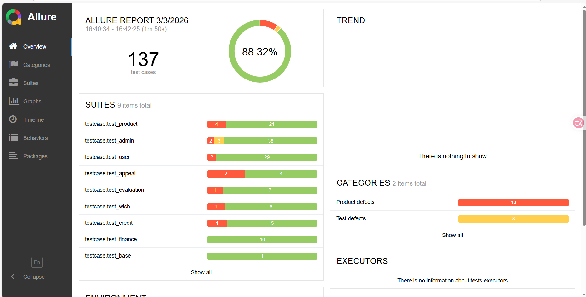
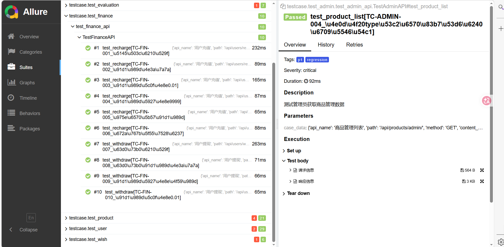
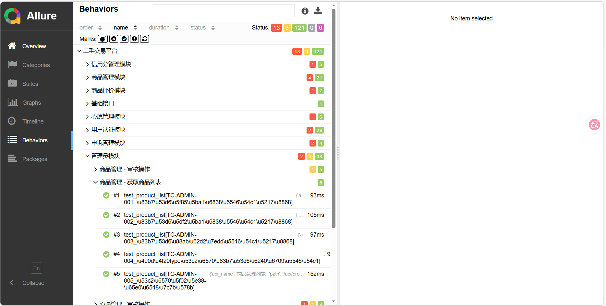

# 接口自动化测试框架 (apiautotest)

基于pytest的接口自动化测试框架，专为Django REST API设计。

### 测试结果概览


### 用例执行详情


### 详细测试数据


## 📁 项目结构

```
apiautotest/
├── common/           # 通用工具模块
│   ├── read_yaml.py   # YAML数据读取
│   ├── read_excel.py  # Excel数据读取
│   └── logger.py      # 日志管理
├── config/           # 配置文件
│   └── settings.py    # 环境配置
├── core/             # 核心模块
│   ├── send_request.py # HTTP请求核心类
│   └── data_driver.py  # 数据驱动
├── data/             # 测试数据
│   ├── user/          # 用户模块测试数据
│   ├── product/       # 商品模块测试数据
│   └── admin/         # 管理员模块测试数据
├── testcase/         # 测试用例
│   ├── base_test.py   # 测试基类
│   ├── test_user/     # 用户模块测试
│   └── test_admin/    # 管理员模块测试
├── utils/            # 工具脚本
│   └── excel_to_yaml.py # Excel转YAML工具
├── reports/          # 测试报告
├── logs/             # 日志文件
├── conftest.py       # pytest配置
├── pytest.ini        # pytest配置文件
├── run.py            # 运行入口
└── requirements.txt  # 依赖包
```

## 🚀 快速开始

### 1. 安装依赖

```bash
pip install -r requirements.txt
```

### 2. 运行测试

```bash
# 运行所有测试
python run.py

# 指定环境运行
python run.py --env test

# 运行指定模块
python run.py --module user

# 按标签运行
python run.py --tag smoke

# 生成HTML报告
python run.py --report
```

### 3. pytest直接运行

```bash
# 运行冒烟测试
pytest -m smoke

# 运行P0级别测试
pytest -m p0

# 运行用户模块测试
pytest testcase/test_user/

# 生成Allure报告
pytest --alluredir=./reports/allure_results
allure serve ./reports/allure_results
```

## 📊 测试数据格式

### YAML测试数据示例

```yaml
# data/user/login.yaml
api_name: 用户登录
path: /api/users/login/
method: POST
content_type: application/json
auth_required: false

test_cases:
  - id: TC-AUTH-001
    name: 学生用户成功登录
    description: 验证学生用户可以正常登录
    tags: [smoke, p0, 用户认证]
    data:
      user_type: student
      username: testuser
      password: test123
    expected:
      status_code: 200
      success: true
      check_points:
        - "resp_json.get('user') is not None"
        - "resp_json['user']['username'] == 'testuser'"
```

### 支持的断言类型

1. **状态码断言**
   ```yaml
   expected:
     status_code: 200
   ```

2. **响应字段断言**
   ```yaml
   expected:
     success: true
     message: "登录成功"
   ```

3. **消息包含断言**
   ```yaml
   expected:
     message_contains: ["用户名", "不能为空"]
   ```

4. **自定义检查点**
   ```yaml
   expected:
     check_points:
       - "resp_json['user']['credit_score'] >= 80"
       - "len(resp_json['products']) > 0"
   ```

## 🔧 核心功能

### 1. 自动认证管理
- 自动处理CSRF Token
- Session会话管理
- 支持多用户类型（学生、管理员）

### 2. 数据驱动测试
- YAML/Excel数据源支持
- 参数化测试用例
- 动态数据生成

### 3. 智能断言
- 状态码断言
- 响应体字段断言
- 自定义表达式断言
- Allure报告集成

### 4. 环境配置
```python
# config/settings.py
ENVIRONMENTS = {
    'dev': {
        'base_url': 'http://localhost:8000',
        'timeout': 30
    },
    'test': {
        'base_url': 'http://test-api.example.com',
        'timeout': 30
    }
}
```

## 🎯 测试标记规范

| 标记 | 说明 | 使用场景 |
|------|------|----------|
| `@pytest.mark.smoke` | 冒烟测试 | 核心功能验证 |
| `@pytest.mark.p0` | P0级别 | 必须通过的核心用例 |
| `@pytest.mark.p1` | P1级别 | 重要功能用例 |
| `@pytest.mark.p2` | P2级别 | 一般功能用例 |
| `@pytest.mark.regression` | 回归测试 | 功能稳定性验证 |

## 📈 报告生成

### HTML报告
```bash
python run.py --report
```

### Allure报告
```bash
pytest --alluredir=./reports/allure_results
allure serve ./reports/allure_results
```

## 🛠️ 工具脚本

### Excel转YAML
```bash
python utils/excel_to_yaml.py 接口测试用例.xlsx
```

## 🔒 认证机制

### 自动认证流程
1. 检查用例是否需要认证 (`auth_required`)
2. 如需要认证，自动登录获取Session
3. 自动获取并添加CSRF Token
4. 请求自动携带Cookie和Headers

### 手动控制认证
```python
# 清除认证信息（测试无登录态场景）
self.request.clear_auth()

# 手动登录
self.request.login('student', 'username', 'password')

# 获取CSRF Token
token = self.request.get_csrf_token()
```

## 📝 开发规范

### 测试用例命名
- 文件名：`test_[模块名]_[功能].py`
- 类名：`Test[模块名]API`
- 方法名：`test_[功能描述]`

### YAML文件结构
- 每个API一个YAML文件
- 文件名与API功能对应
- 用例ID遵循TC-[模块]-[序号]格式

### 代码风格
- 遵循PEP8规范
- 使用类型注解
- 详细的docstring文档

## 🐛 常见问题

### 1. CSRF Token获取失败
```bash
# 检查CSRF接口是否可访问
curl http://localhost:8000/api/users/csrf-token/
```

### 2. Session过期
```python
# 在测试前重新登录
@pytest.fixture
def authenticated_request():
    req = SendRequest()
    req.login('student', 'user', 'pass')
    yield req
    req.logout()
```

### 3. 环境配置问题
```bash
# 设置环境变量
export TEST_ENV=test
# 或在Windows中
set TEST_ENV=test
```

## 📚 参考资料

- [pytest官方文档](https://docs.pytest.org/)
- [Allure报告文档](https://docs.qameta.io/allure/)
- [Requests库文档](https://requests.readthedocs.io/)
